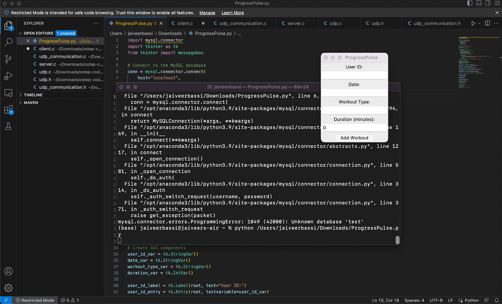
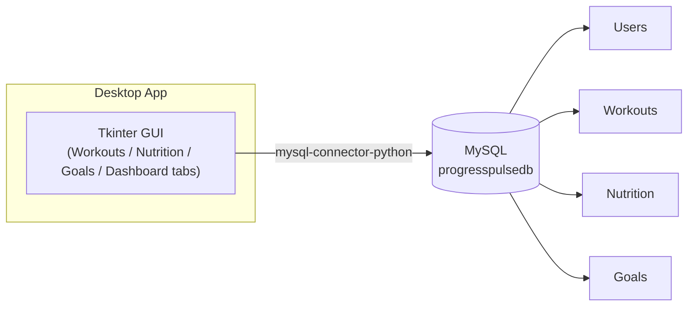
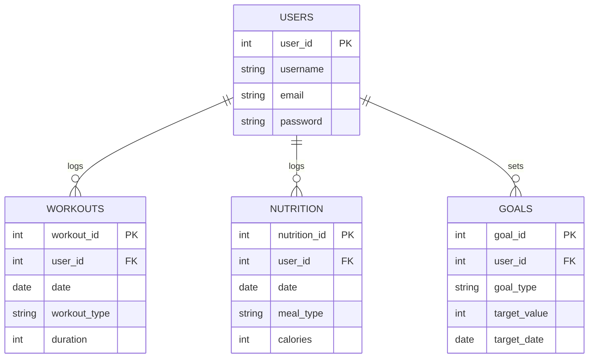
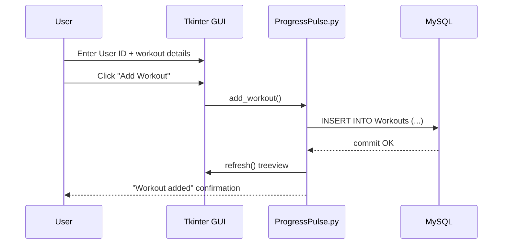
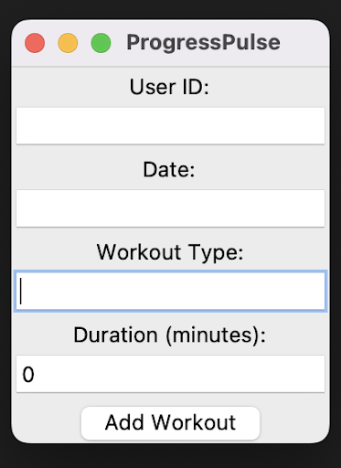
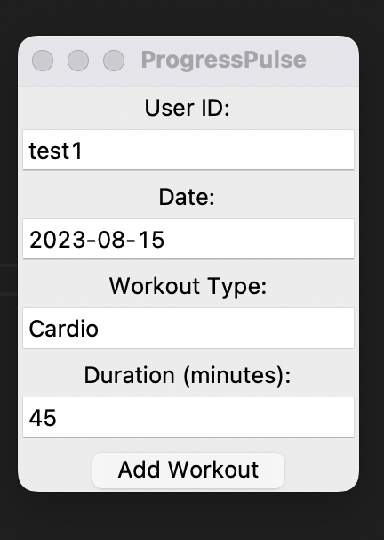

# ProgressPulse - Fitness Tracking Application

<sup>Made by Jaiveer Bassi for CS360: Database Management Systems</sup>

Track your fitness journey with ProgressPulse, a GUI-based fitness-tracking application built using Python and MySQL.

## Introduction

ProgressPulse is a desktop fitness-tracking application that lets users log workouts, nutrition intake, and goals, and see a quick summary of their progress. It's built with a Tkinter GUI on top of a MySQL database.

This started as a small project for a database class, and I've since cleaned it up: the GUI now has real tabs for each data type, a dashboard, and the ability to view/delete records instead of only inserting them. Credentials are no longer hardcoded — they're read from a `.env` file.

## Features

- Log and manage workouts with date, workout type, and duration.
- Track nutrition intake with meal type and calorie counts.
- Set fitness goals with a target value and target date.
- View, filter by user, and delete any logged record.
- Dashboard tab with totals: workouts logged, minutes trained, calories logged, active goals.
- Configuration via environment variables — no secrets in source code.



## How it fits together



## Database schema



## Adding a workout, end to end



## Installation

1. Clone the repository:

   ```bash
   git clone https://github.com/imjbassi/ProgressPulse.git
   cd ProgressPulse
   ```

2. Install MySQL if you don't already have it: https://www.mysql.com/downloads/

   - On macOS with Homebrew: `brew install mysql`
   - On Windows: use the MySQL Installer from the link above.

3. Install Python dependencies:

   ```bash
   pip install -r requirements.txt
   ```

4. Create the database using the provided schema:

   ```bash
   mysql -u root -p < database.sql
   ```

5. Set up your local configuration. Copy `.env.example` to `.env` and fill in your MySQL credentials:

   ```bash
   cp .env.example .env
   ```

   ```env
   PP_DB_HOST=localhost
   PP_DB_USER=root
   PP_DB_PASSWORD=your_password_here
   PP_DB_NAME=progresspulsedb
   ```

   `.env` is git-ignored, so your password never gets committed.

## Usage

1. Run the application:

   ```bash
   python ProgressPulse.py
   ```

2. Enter a `User ID` at the top of the window (create one first via SQL if the `Users` table is empty), then click **Refresh**.

3. Use the tabs to log workouts, nutrition, and goals. Select any row and click **Delete Selected** to remove it. Check the **Dashboard** tab for a running summary.

## Project structure

```
ProgressPulse/
├── ProgressPulse.py     # Tkinter GUI + app logic
├── database.sql         # MySQL schema (Users, Workouts, Nutrition, Goals)
├── requirements.txt     # Python dependencies
├── .env.example          # Sample environment configuration
└── Images/               # Screenshots used in this README
```

## Database schema (reference)

- `Users` (user_id, username, email, password)
- `Workouts` (workout_id, user_id, date, workout_type, duration)
- `Nutrition` (nutrition_id, user_id, date, meal_type, calories)
- `Goals` (goal_id, user_id, goal_type, target_value, target_date)

## Screenshots

 

## Possible next steps

- User authentication (hash passwords instead of storing plain text).
- Charts for progress over time (e.g. matplotlib in the Dashboard tab).
- Swap Tkinter for a web front end.

## Disclaimer

ProgressPulse started as a personal project for a database management class. I've gone back and tidied it up since, but it's still a small learning project, not production software — don't point it at a database with data you care about without reviewing it first.
